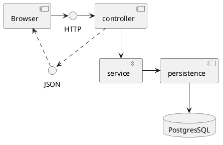
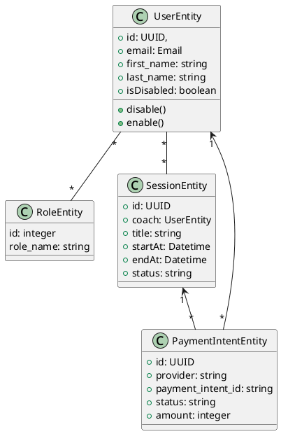
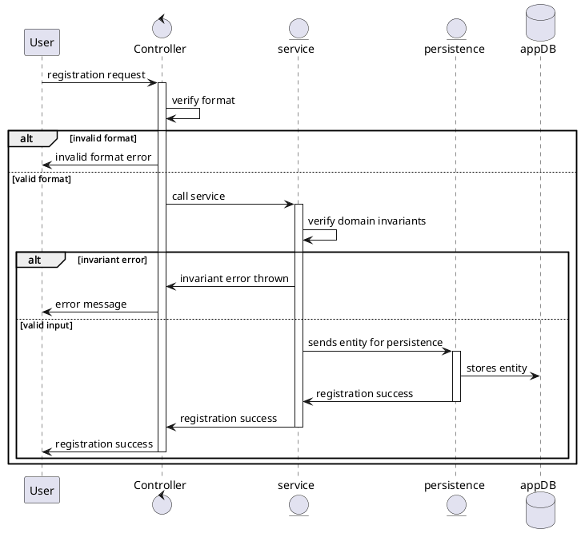
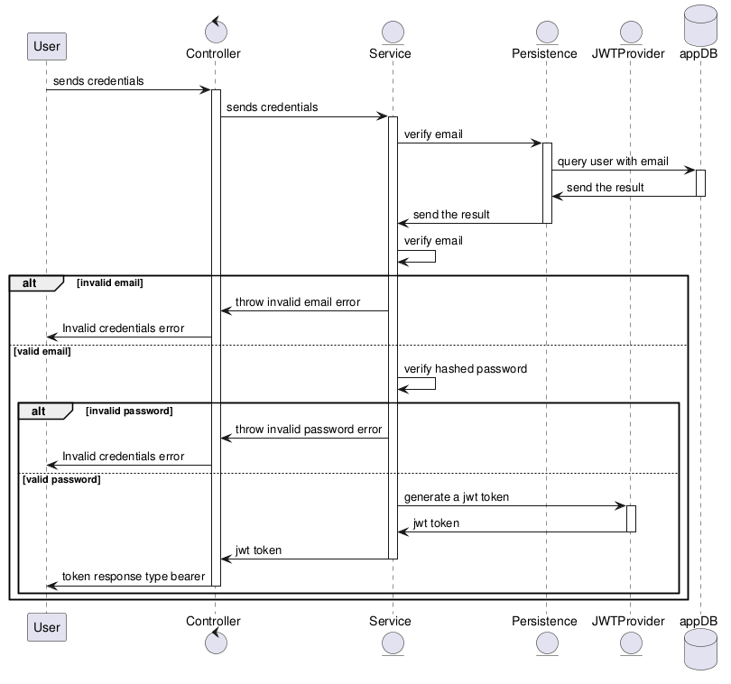

# Technical documentation

## Overview

This document contains the technical documentation for this project:
- User stories
- Architecture diagram
- Mockup
- UML Diagrams (sequence, component, class)
- API specifications
- SCM and QA strategies

## Summary
- [User stories](#user-stories-moscow-prioritization)
- [Architecture diagram](#architecture-diagram)
- [Mockup](#mockup)
- [UML diagrams](#uml-diagrams)
	- [Component diagram](#component-diagram)
	- [Class diagram](#class-diagram)
	- [Sequence diagrams](#sequence-diagrams)
- [API specifications](#api-specifications)
- [SCS and QA strategies](#scm-and-qa-strategies)

## User stories (MoSCoW Prioritization)

### Must have (MVP)

#### User

- As a user, I want to create an account and log in, so that I can access the gym platform.
- As a user, I want to view available gym sessions, so that I can choose a session that fits my schedule.
- As a user, I want to subscribe to a gym session, so that I can participate in it.
- As a user, I want to pay for a gym session online, so that my subscription is confirmed.

#### Coach

- As a coach, I want to create gym sessions, so that users can subscribe to them.
- As a coach, I want to define the maximum number of participants per session, so that sessions are not overbooked.

#### Administrator

- As an administrator, I want to manage users, coaches, and sessions, so that the platform remains organized and functional.
- As an administrator, I want to view session subscriptions, so that I can monitor gym usage.

### Should have

- As a coach, I want to view the list of subscribed users, so that I can prepare my sessions.
- As a human resources manager, I want to generate an attendance list for each session, so that I can track employee participation.
- As a user, I want to view my subscribed sessions, so that I can manage my gym schedule.

### Could have

- As a user, I want to leave a review for a gym session, so that I can provide feedback to the coach.

### Won’t Have (Out of scope for MVP)

- As a user, I want to receive personalized session recommendations, so that I can discover new workouts.
- As a user, I want to receive push notifications, so that I am reminded of upcoming sessions.

---

## Architecture diagram

### Front-end (Svelte)

The web application communicates with the backend API using secure HTTPS requests. It allows users to browse sessions, register, and perform payments.

### Backend API (FastAPI)

This is the core of the application. It handles the main business logic through two modules:
 - Auth, Session and Registration → manages user authentication, sessions, and user registrations.
 - Session Management → handles session creation, availability, and attendance validation.

### Database (PostgreSQL & NoSQL)

PostgreSQL stores structured data such as users, sessions, registrations, and payment status.
The NoSQL database is used for logs and activity tracking.
Only the backend API accesses the databases.

### Stripe (Payments)

Stripe is used as an external payment service. The backend sends payment requests to Stripe, and Stripe sends webhooks back to the API to confirm payment results.

---

## Mockup

[Mockup link](https://www.figma.com/design/wSTX2BrVHm3k0cKqiWuFJX/Actual-Digital-Gym?node-id=0-1&p=f)

Low-fidelity mockups were created to visualize the main interfaces of the MVP.
These screens cover the essential actions:
viewing sessions, creating a session, and validating attendance by the coach.

### MVP scope

Create a session → User registers → Coach marks attendance.

---

## UML diagrams

### Component diagram

This diagram shows the main loop components of the system:
- Browser, the client browser
- Controller, rest endpoint receiving http request and parsing them into usable data, also verify token before calling a service
- Service, perform domain checks and invariants before commiting to a change
- Persistence, this layer is about persistence logic it will call the db once done
- Database, this layer is about storing the datas

### Class diagram

This class diagram represents the main entity that will be involved in the system:
- UserEntity represents a user
- RoleEntity represents a role a user has, can be a coach, and admin or a normal user
- SessionEntity represents a gym session
- PaymentIntent represents a payment intent for when a user pay for a session

### Sequence diagrams

#### Registration sequence

Typical sequence for a registration request

#### Authentication sequence

Typical sequence for an authentication request

---

## API specifications

### Auth

#### Route: PUT /auth/login

| Field                      | Description |
| -------------------------- | ----------- |
| Method                     | PUT         |
| Endpoint                   | /auth/login |
| Auth required              | no          |
| Required permission / role | none        |
| Description                | basic route for logging into the system |
| Request body               | email, password |
| Success response           | 201 successful_login|
| Error responses            | 422 Unprocessable content, 401 Invalid credentials        |
| Audit action               | LOGIN_SUCCESSFUL, LOGIN_FAILED            |

##### Request body

| Field | Type | Required | Description |
|------|------|----------|-------------|
| email | Email | yes | the user email |
| password | string | yes | the user password |

##### Response body

| Field | Type | Description |
| ----- | ---- | ----------- |
| message|  string    |  successful_login |

#### Route: PUT /auth/token

| Field                      | Description |
| -------------------------- | ----------- |
| Method                     | PUT         |
| Endpoint                   | /auth/token |
| Auth required              | no          |
| Required permission / role | none        |
| Description                | login route for openAPI            |
| Request body               | email, password            |
| Success response           | 200 successful_login            |
| Error responses            | 422 Unprocessable content, 401 Invalid credentials, 400 Bad request        |
| Audit action               | LOGIN_ATTEMPT, LOGIN_FAILED            |

##### Request body

| Field | Type | Required | Description |
|------|------|----------|-------------|
| email | Email | yes | the user email |
| password | string | yes | the user password |

##### Response body

| Field | Type | Description |
| ----- | ---- | ----------- |
| message|  string    |  successful login message |

#### Route: GET /auth/me

| Field                      | Description |
| -------------------------- | ----------- |
| Method                     | GET         |
| Endpoint                   | /auth/me |
| Auth required              | yes (jwt)          |
| Required permission / role | user        |
| Description                | endpoint for fetching the current user            |
| Request body               | N/A            |
| Success response           | 200            |
| Error responses            | 401 Unauthorized, 403 Forbidden        |
| Audit action               | none            |

##### Response body

| Field | Type | Description |
| ----- | ---- | ----------- |
| email |  string  | the user email  |
| first_name | string | the user first name |
| last_name  | string | the user last name |
| roles | list`[string]` | the user roles |

#### Route: PUT /auth/me

| Field                      | Description |
| -------------------------- | ----------- |
| Method                     | PUT         |
| Endpoint                   | /auth/me |
| Auth required              | yes (jwt)          |
| Required permission / role | user        |
| Description                | endpoint for updating the current user            |
| Request body               | email, first_name, last_name            |
| Success response           | 204            |
| Error responses            | 422 Unprocessable content, 401 Unauthorized, 403 Forbidden, 400 Bad request        |
| Audit action               | USER_UPDATED            |

##### Request body

| Field | Type | Required | Description |
|------|------|----------|-------------|
| email | Email | yes | the user email |
| first_name | string | yes | the user first name |
| last_name  | string | yes | the user last name |

#### Route: PATCH /auth/me

| Field                      | Description |
| -------------------------- | ----------- |
| Method                     | PATCH         |
| Endpoint                   | /auth/me |
| Auth required              | yes (jwt)          |
| Required permission / role | user        |
| Description                | endpoint for partialy updating the current user            |
| Request body               | email, first_name, last_name            |
| Success response           | 204            |
| Error responses            | 422 Unprocessable content, 401 Unauthorized, 403 Forbidden, 400 Bad request        |
| Audit action               | USER_UPDATED            |

##### Request body

| Field | Type | Required | Description |
|------|------|----------|-------------|
| email | Email | no | the user email |
| first_name | string | no | the user first name |
| last_name  | string | no | the user last name |

#### Route: DELETE /auth/me

| Field                      | Description |
| -------------------------- | ----------- |
| Method                     | DELETE         |
| Endpoint                   | /auth/me |
| Auth required              | yes (jwt)          |
| Required permission / role | user        |
| Description                | endpoint for deleting the current user            |
| Request body               | N/A                             |
| Success response           | 204            |
| Error responses            | 401 Unauthorized, 403 Forbidden        |
| Audit action               | USER_DELETED           |

#### Route: PUT /auth/me/password-change

| Field                      | Description |
| -------------------------- | ----------- |
| Method                     | PUT         |
| Endpoint                   | /auth/me/password-change |
| Auth required              | yes (jwt)          |
| Required permission / role | user        |
| Description                | endpoint for fetching the current user            |
| Request body               | current_password, new_password            |
| Success response           | 204            |
| Error responses            | 422 Unprocessable content, 401 Unauthorized, 403 Forbidden, 400 Bad Request        |
| Audit action               | PASSWORD_CHANGE            |

##### Request body

| Field | Type | Required | Description |
|------|------|----------|-------------|
| current_password | string | yes | the user current password |
| new_password | string | yes | the user new password |

### Sessions (User & Coach)

#### GET /sessions

| Field                      | Description |
| -------------------------- | ----------- |
| Method                     | GET            |
| Endpoint                   | /sessions/     |
| Auth required              | yes (jwt)            |
| Required permission / role | user            |
| Description                | an endpoint to fetch all the available sessions            |
| Request body               | N/A            |
| Success response           | 200 list of the sessions           |
| Error responses            | 401, Unauthorized, 403 Forbidden            |
| Audit action               | none            |

##### Response body

| Field | Type | Description |
| ----- | ---- | ----------- |
| coach | object    | the coach of the session             |
| title | string | the session title |
| start_at | Datetime | the session starting time |
| end_at | Datetime | the session ending time |

#### PUT /sessions/create

| Field                      | Description |
| -------------------------- | ----------- |
| Method                     | PUT         |
| Endpoint                   | /sessions/create |
| Auth required              | yes          |
| Required permission / role | coach        |
| Description                | session creation route for coaches            |
| Request body               | title, start_at, end_at            |
| Success response           | 201 creation_successful            |
| Error responses            | 422 Unprocessable content, 401 Unauthorized, 403 Forbidden, 400 Bad request        |
| Audit action               | SESSION_CREATED           |

##### Request body

| Field | Type | Required | Description |
|------|------|----------|-------------|
| title | string | yes | the session title |
| start_at | Datetime | yes | the starting date and time of the session |
| end_at | Datetime | yes | the finishing date and time of the session |

##### Response body

| Field | Type | Description |
| ----- | ---- | ----------- |
| message|  string    |  session_created |

#### PUT /sessions/{session_id}/cancel

| Field                      | Description |
| -------------------------- | ----------- |
| Method                     | PUT         |
| Endpoint                   | /sessions/{session_id}/cancel |
| Auth required              | yes (jwt)         |
| Required permission / role | coach        |
| Description                | session cancellation route for coaches            |
| Request body               | N/A            |
| Success response           | 204             |
| Error responses            | 401 Unauthorized, 403 Forbidden, 400 Bad request       |
| Audit action               | SESSION_CANCELED            |

#### POST /sessions/{session_id}/register

| Field                      | Description |
| -------------------------- | ----------- |
| Method                     | POST            |
| Endpoint                   | /sessions/{session_id}/register     |
| Auth required              | yes (jwt)            |
| Required permission / role | user            |
| Description                | an endpoint to register users in a session            |
| Request body               | N/A            |
| Success response           | 200 registration successful           |
| Error responses            | 401 Unauthorized, 403 Forbidden, 400 Bad request            |
| Audit action               | USER_REGISTRATION            |

##### Response body

| Field | Type | Description |
| ----- | ---- | ----------- |
| message | string    | registration successful             |

#### GET /sessions/{session_id}

| Field                      | Description |
| -------------------------- | ----------- |
| Method                     | GET            |
| Endpoint                   | /sessions/{session_id}     |
| Auth required              | yes (jwt)            |
| Required permission / role | coach            |
| Description                | an endpoint to fetch a session and all the participants of a session            |
| Request body               | N/A            |
| Success response           | 200 JSON response           |
| Error responses            | 401 Unauthorized, 403 Forbidden            |
| Audit action               | none           |

##### Response body

| Field | Type | Description |
| ----- | ---- | ----------- |
| session_id | UUID    |  the unique identifier of a session             |
| title | string | the title of a session |
| start_at | Datetime | the start date and time of a session |
| end_at | Datetime| the finishing date and time of the session |
| attendes | `List[User]` | the list of all attendees of that session |

#### PUT /sessions/{session_id}/attendance

| Field                      | Description |
| -------------------------- | ----------- |
| Method                     | PUT            |
| Endpoint                   | /sessions/{session_id}/attendance     |
| Auth required              | yes (jwt)            |
| Required permission / role | coach            |
| Description                | an endpoint to decide who was present or not            |
| Request body               | `list[registration_id]`            |
| Success response           | 204           |
| Error responses            | 422 Unprocessable content, 401 Unauthorized, 403 Forbidden, 400 Bad request            |
| Audit action               | COACH_ATTENDANCE            |

##### Response body

| Field | Type | Description |
| ----- | ---- | ----------- |
| session_id | UUID    |  the unique identifier of a session             |
| title | string | the title of a session |
| start_at | Datetime | the start date and time of a session |
| end_at | Datetime| the finishing date and time of the session |
| attendes | `List[User]` | the list of all attendees of that session |

### Admin – Users

#### GET /admin/users

| Field                      | Description |
| -------------------------- | ----------- |
| Method                     | GET            |
| Endpoint                   | /admin/users     |
| Auth required              | yes (jwt)            |
| Required permission / role | admin            |
| Description                | an endpoint to fetch all users            |
| Request body               | N/A            |
| Success response           | 200 JSON response           |
| Error responses            | 401 Unauthorized, 403 Forbidden            |
| Audit action               | none           |

##### Response body

| Field | Type | Description |
| ----- | ---- | ----------- |
| session_id | UUID    |  the unique identifier of a session             |
| title | string | the title of a session |
| start_at | Datetime | the start date and time of a session |
| end_at | Datetime| the finishing date and time of the session |

#### GET /admin/users/{user_id}

| Field                      | Description |
| -------------------------- | ----------- |
| Method                     | GET            |
| Endpoint                   | /admin/users/{user_id}     |
| Auth required              | yes (jwt)            |
| Required permission / role | admin            |
| Description                | an endpoint to fetch a user            |
| Request body               | N/A            |
| Success response           | 200 JSON response           |
| Error responses            | 401 Unauthorized, 403 Forbidden            |
| Audit action               | none           |

##### Response body

| Field | Type | Description |
| ----- | ---- | ----------- |
| id | UUID    |  the unique identifier of a user             |
| email | Email | the email of a user |
| first_name | string | the first name of a user |
| last_name | string | the last name of a user |
| roles | `list[string]` | the roles of a user |

#### PUT /admin/users/{user_id}/disable

| Field                      | Description |
| -------------------------- | ----------- |
| Method                     | PUT           |
| Endpoint                   | /admin/users/{user_id}/disable     |
| Auth required              | yes (jwt)            |
| Required permission / role | admin            |
| Description                | an endpoint to disable a user            |
| Request body               | N/A            |
| Success response           | 204           |
| Error responses            | 401 Unauthorized, 403 Forbidden            |
| Audit action               | ADMIN_USER_DISABLE           |

#### PUT /admin/users/{user_id}/grant-role

| Field                      | Description |
| -------------------------- | ----------- |
| Method                     | PUT         |
| Endpoint                   | /admin/users/{user_id}/grant-role |
| Auth required              | yes (jwt)          |
| Required permission / role | admin        |
| Description                | endpoint for fetching the current user            |
| Request body               | current_password, new_password            |
| Success response           | 204            |
| Error responses            | 422 Unprocessable content, 401 Unauthorized, 403 Forbidden, 400 Bad Request        |
| Audit action               | ROLE_GRANTED            |

##### Request body

| Field | Type | Required | Description |
|------|------|----------|-------------|
| role | string | yes | the role to give the user |

#### PUT /admin/users/{user_id}/revoke-role

| Field                      | Description |
| -------------------------- | ----------- |
| Method                     | PUT         |
| Endpoint                   | /admin/users/{user_id}/revoke-role |
| Auth required              | yes (jwt)          |
| Required permission / role | admin        |
| Description                | endpoint for fetching the current user            |
| Request body               | current_password, new_password            |
| Success response           | 204            |
| Error responses            | 422 Unprocessable content, 401 Unauthorized, 403 Forbidden, 400 Bad Request        |
| Audit action               | ROLE_REVOKED            |

##### Request body

| Field | Type | Required | Description |
|------|------|----------|-------------|
| role | string | yes | the role to revoke from the user |

### Admin – Invite links

#### POST /admin/links/invite-links

| Field                      | Description |
| -------------------------- | ----------- |
| Method                     | POST            |
| Endpoint                   | /admin/links/invite-links |
| Auth required              | yes (jwt)            |
| Required permission / role | admin            |
| Description                | an endpoint to generate an invite link            |
| Request body               | role, expires_at            |
| Success response           | 200 invite link           |
| Error responses            | 422 Unprocessable content, 401 Unauthorized, 403 Forbidden, 400 Bad request            |
| Audit action               | INVITE_LINK_CREATED |

##### Request body

| Field | Type | Required | Description |
|------|------|----------|-------------|
| role | string | yes | role granted to the user using that link |
| expires_at | Datetime | yes | limit date to consume the link |

##### Response body

| Field | Type | Description |
| ----- | ---- | ----------- |
| invite_url | string    |  the invite link for registration           |

### Admin – Sessions

#### GET /admin/sessions

| Field                      | Description |
| -------------------------- | ----------- |
| Method                     | GET            |
| Endpoint                   | /admin/sessions/
| Auth required              | yes (jwt)            |
| Required permission / role | admin            |
| Description                | an endpoint to get a list of all sessions            |
| Request body               | N/A            |
| Success response           | 200 `list[sessions]`           |
| Error responses            | 401 Unauthorized, 403 Forbidden            |
| Audit action               | none |

##### Response body

| Field | Type | Description |
| ----- | ---- | ----------- |
| sessions | `list[session]`    |  a list of all sessions including cancelled ones           |

#### GET /admin/sessions/{coach_id}

| Field                      | Description |
| -------------------------- | ----------- |
| Method                     | GET            |
| Endpoint                   | /admin/sessions/{coach_id}
| Auth required              | yes (jwt)            |
| Required permission / role | admin            |
| Description                | an endpoint to get a list of all sessions created by a coach           |
| Request body               | N/A            |
| Success response           | 200 `list[sessions]`           |
| Error responses            | 401 Unauthorized, 403 Forbidden            |
| Audit action               | none |

##### Response body

| Field | Type | Description |
| ----- | ---- | ----------- |
| sessions | `list[session]`    |  a list of all sessions created by a coach           |

#### PUT /admin/sessions/{session_id}/cancel

| Field                      | Description |
| -------------------------- | ----------- |
| Method                     | GET            |
| Endpoint                   | /admin/sessions/{coach_id} |
| Auth required              | yes (jwt)            |
| Required permission / role | admin            |
| Description                | an endpoint to cancel a session           |
| Request body               | N/A            |
| Success response           | 204           |
| Error responses            | 401 Unauthorized, 403 Forbidden            |
| Audit action               | SESSION_CANCELED |

### POST /webhooks/stripe

| Field                      | Description |
| -------------------------- | ----------- |
| Method                     | GET            |
| Endpoint                   | /webhooks/stripe
| Auth required              | no            |
| Required permission / role | stripe            |
| Description                | an endpoint to receive events from stripe           |
| Request body               | id, type, data            |
| Success response           | 204            |
| Error responses            | 401 Unauthorized, 403 Forbidden            |
| Audit action               | none |

##### Request body

| Field | Type   | Required | Description                    |
| ----- | ------ | -------- | ------------------------------ |
| id    | string | Yes      | Stripe event ID                |
| type  | string | Yes      | Stripe event type              |
| data  | object | Yes      | Event payload (varies by type) |

## SCM and QA Strategies

#### Source Control Management (SCM)
Git is used for version control to manage the project codebase and collaboration.

##### Branching strategy:

- main → contains stable, production-ready code.
- development → integration branch where validated features are merged.
- feature branches → each new feature or fix is developed in a separate branch.

Before merging into the development or main branch, the code is reviewed to ensure correctness and consistency.
Regular commits are encouraged to keep track of changes and facilitate collaboration.

#### QA (Quality Assurance)

The objective of quality assurance is to ensure that the application is reliable, secure, and easy to maintain.

##### Testing strategy:

- Unit tests → test individual backend functions and logic.
- API tests → verify FastAPI endpoints such as authentication, session creation, and registration.
- Manual tests → validate critical user flows such as registration, session enrollment, and payment.

##### Tools used:
- Pytest → automated testing for FastAPI backend.
- Postman → manual testing of API endpoints.

#### Deployment Pipeline

- Development → local environment for coding and quick testing.
- Staging → testing environment with a real database and Stripe test keys.
- Production → final deployment with real users and real payments (planned for a later phase).
